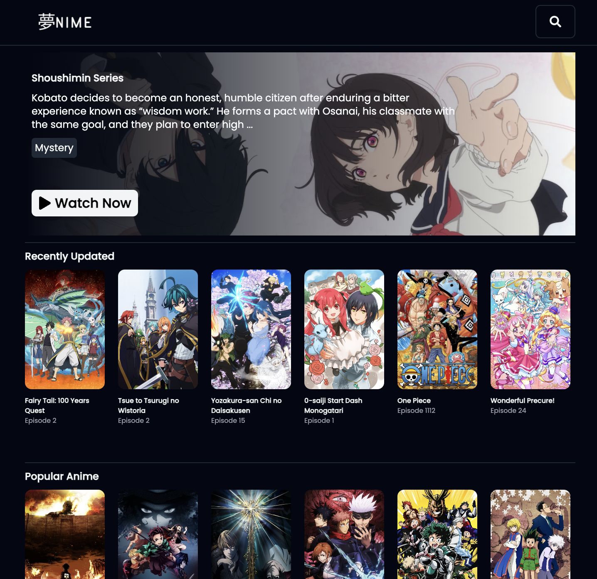

# 🌙 YumeNime



YumeNime is short for "夢" (Yume = Dream), and "Anime" is an anime streaming website powered by [Consumet](https://github.com/consumet/api.consumet.org) and [amvstrm](https://github.com/amvstrm/api) API. You can watch all kinds of anime for free without ads on any screen size.

> The design of this app is inspired from [anirohi](https://github.com/gneiru/anirohi.git)

### Tools that used in this app

- Next.js
- TypeScript
- Tailwind CSS
- shadcn/ui
- React Player

## Installation

1. Clone this repository

```bash
  git clone https://github.com/reynaldomarchell/yumenime.git
```

2.  Go to the project directory and open VS Code

```bash
  cd yumenime
  code .
```

3. Change `.env.example` to `.env.local`, then fill in your API key

```bash
  # Input your amvstrm and Consumet API key here
  NEXT_PUBLIC_AMVSTRM =
  NEXT_PUBLIC_CONSUMET =
```

4. Install the dependencies and run the app

```bash
  npm i
  npm run dev
```

5. App will run on http://localhost:3000
